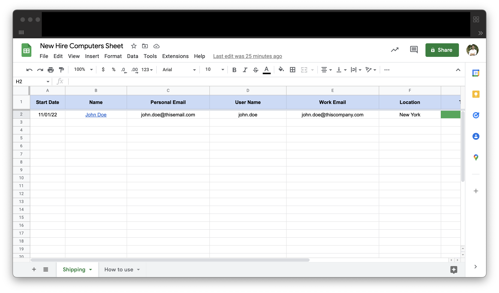
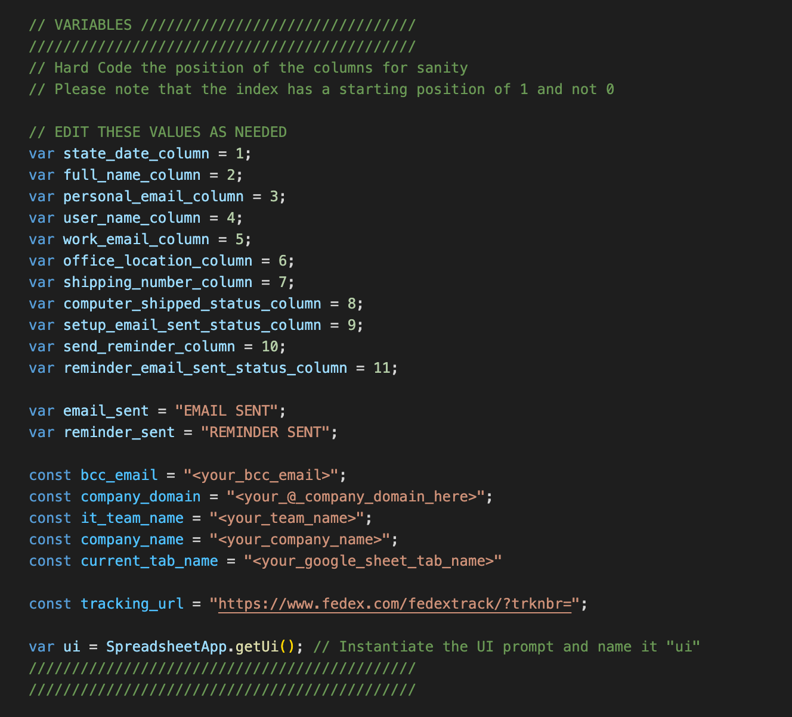
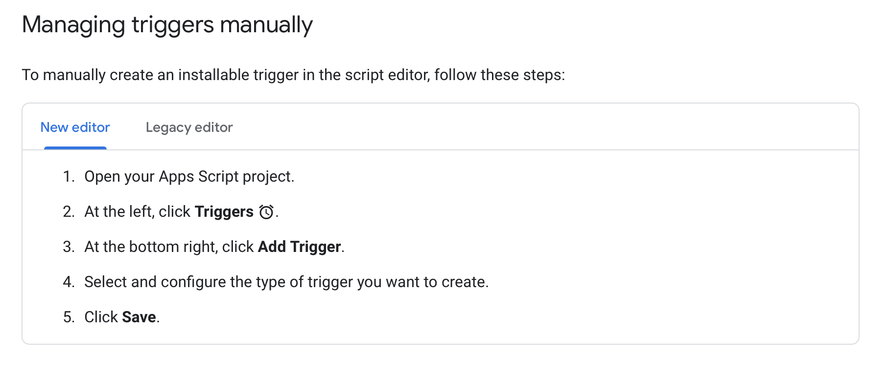
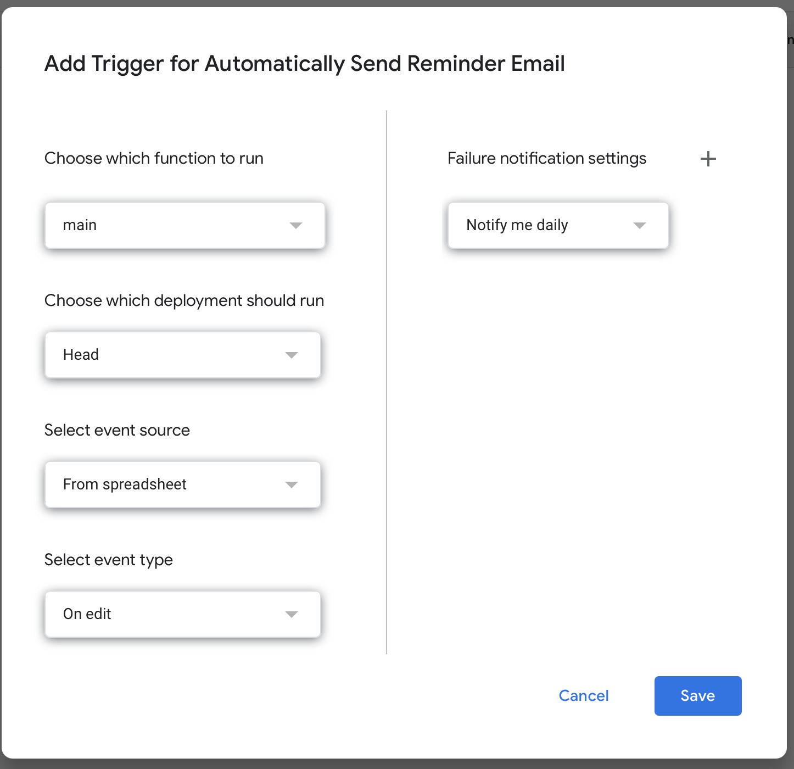
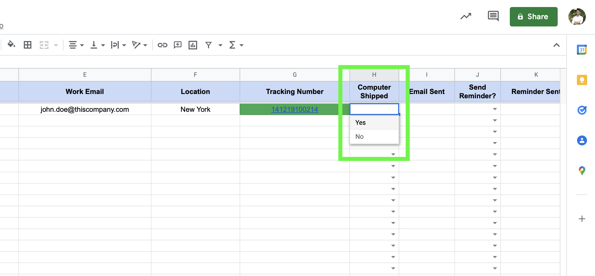

# New Hire Computer Sheet - POC

## Script Use Case

(Courtesy to stock photo from who this image belongs to)

I made this script for teams that currently do not have macOS machines that are bound to activedirectory, or JamfConnect/Nomad. Users have to manually setup their machines with their accounts.
To help mitigate that, we have to send mass emails to our new hires when their laptop is being shipped out to them and have them setup their computer before their first day, where services like JAMF/DEP Notify can handle the majority of the setup. The user mainly has to worry about setting up their account.

This script will send emails out to the new hires with their tracking number in a link, as well as any other corresponding information.

Basically, automate a process that used to be done from several team members that can be managed and done via one Google Sheet.

## This is a proof of concept on how to use Google's App Scripts feature to send out mass emails to users who are expecting equipment via a delivery service.

I made this script for my team in order to eliminate the need of having different team members sending out the same kind of email for whenever a new hire signed up, and expected a laptop with tracking information.

## What this App Script can do

Google has their flavor of Javascript they like to call Google Script. So this script basically had Javascript in mind, with some tools from Google's app scripts documentation here:

[script_doc](https://developers.google.com/apps-script)

### This script will do the following for you:
1.  Take your user's work email, and automatically set the User name and Full name of the corresponding columns of that row.
2. Upon setting Computer Shipped column to `Yes`, an email will be generated and sent to the user via their Personal Email.
3. If the EMAIL SENT flag has been set, then you can use the `Send Reminder` flag to follow up with the user on getting their computer setup.

## How To Use
1. Import the CSV into a Google Sheet.

2. Edit your variables to match your company details in a preferred text editor (e.g. Sublime, Visual Studio Code)

3. Activate a trigger with your account on the `main` function in this script, or preferrably a shared support account your team has access to.

Make sure to set the event type for the trigger to `on edit`  Follow the steps from Google for more information on Triggers:

[Google Triggers in app Scripts](https://developers.google.com/apps-script/guides/triggers/installable)

4. Test your App Script Trigger. Set the Computer Shipped column for a given row to Yes. If you are missing any information required to send the email, it will tell you.

